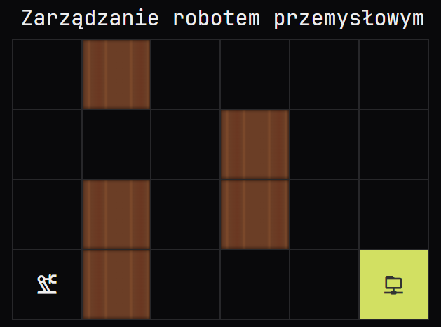

# 🤖 Robot Navigation Task – AI_devs3

Zadanie / Task from: **AI_devs 3 – S01E04: Techniki optymalizacji**

---

## 🇵🇱 Opis zadania (PL)

Zadanie polega na wygenerowaniu optymalnej ścieżki dla robota poruszającego się po siatce 6x4, w której znajdują się przeszkody. Robot sterowany jest przez duży model językowy (LLM), który musi zwrócić poprawny JSON opisujący kolejne ruchy robota.



### 🎯 Cel

Doprowadzenie robota z pozycji startowej `[0, 0]` do celu `[5, 0]` z pominięciem przeszkód, przy użyciu najkrótszej możliwej ścieżki.

### 🧱 Założenia

- Rozmiar planszy: `6 x 4` (x: 0–5, y: 0–3)
- Pozycja startowa: `[0, 0]`
- Pozycja docelowa: `[5, 0]`
- Dostępne kierunki ruchu: `UP`, `DOWN`, `LEFT`, `RIGHT`
- Przeszkody: `[1,0]`, `[1,1]`, `[1,3]`, `[3,1]`, `[3,2]`
- Robot nie może wyjść poza granice planszy
- Odpowiedź musi zawierać tag `<RESULT>` oraz poprawnie sformatowany JSON

### 🧠 Wykorzystana technika

Zadanie testuje zdolność LLM do planowania przestrzennego, logicznego myślenia i generowania kodu w określonej strukturze JSON. Prompt uwzględnia również "tok rozumowania", aby model mógł wykonać operacje krok po kroku.

### 🧾 Użyty prompt

```
Jesteś operatorem robota przemysłowego. Twoim zadaniem jest wygenerować optymalną ścieżkę od startu do celu, unikając przeszkód. Oczekiwanym formatem odpowiedzi jest **tylko** obiekt JSON zawierający tablicę kroków w polu `steps`.

Zasady:
1. Robot startuje z pozycji: [0, 0]
2. Celem jest pozycja: [5, 0]
3. Robot może się poruszać w kierunkach: UP, DOWN, LEFT, RIGHT
4. Przeszkody (niedozwolone pola): [1,0], [1,1], [1,3], [3,1], [3,2]
5. Robot nie może wyjść poza siatkę (rozmiar planszy: 6x4 [x=0..5, y=0..3])
6. Podaj tylko możliwą do przejścia trasę w najkrótszej liczbie kroków
7. Wypisz swój tok rozumowania. Po kolei napisz swój ruch i jego uzasadnienie.
8. Na koniec zwróć JSON w poniższym formacie:
<RESULT>
{
  "steps": "RIGHT, LEFT, UP, DOWN"
}
</RESULT>
9. Pamietaj o tagach <RESULT>, są one istotne dla tego zadania.
```

### ✅ Przykład odpowiedzi

```json
<RESULT>
{
  "steps": "RIGHT, RIGHT, UP, UP, RIGHT, RIGHT, DOWN, DOWN"
}
</RESULT>
```

---

## 🇬🇧 Task Description (EN)

The goal is to generate the shortest valid path for a robot on a 6x4 grid containing obstacles. The robot is controlled by a large language model (LLM), which must return a valid JSON describing the sequence of moves.

### 🎯 Objective

Navigate the robot from the starting position `[0, 0]` to the target `[5, 0]` while avoiding obstacles and staying within the grid. The path should be as short as possible.

### 🧱 Constraints

- Grid size: `6 x 4` (x: 0–5, y: 0–3)
- Start position: `[0, 0]`
- Goal position: `[5, 0]`
- Allowed directions: `UP`, `DOWN`, `LEFT`, `RIGHT`
- Obstacles: `[1,0]`, `[1,1]`, `[1,3]`, `[3,1]`, `[3,2]`
- The robot cannot go outside the grid
- The result must be enclosed in `<RESULT>` tags and formatted as valid JSON

### 🧠 Model Capabilities Tested

This task tests the LLM's ability to reason spatially, plan logically, and generate structured output in JSON format. The prompt also requires the model to describe its step-by-step reasoning before returning the result.

### 🧾 Prompt used

```
You are an industrial robot operator. Your task is to generate the optimal path from the start to the goal while avoiding obstacles. The expected output is ONLY a JSON object with a `steps` field listing the move sequence.

Rules:
1. Start position: [0, 0]
2. Goal position: [5, 0]
3. Valid directions: UP, DOWN, LEFT, RIGHT
4. Obstacles: [1,0], [1,1], [1,3], [3,1], [3,2]
5. Grid size: 6x4 (x=0..5, y=0..3)
6. Find the shortest valid path
7. Write out your reasoning line by line
8. Return your answer in this format:
<RESULT>
{
  "steps": "RIGHT, LEFT, UP, DOWN"
}
</RESULT>
9. Remember to include the <RESULT> tags – they are required by the system.
```

### ✅ Sample Answer

```json
<RESULT>
{
  "steps": "RIGHT, RIGHT, UP, UP, RIGHT, RIGHT, DOWN, DOWN"
}
</RESULT>
```

---

## 🏁 Outcome

A correct response returns the **final flag** 🎉 from the challenge system.
